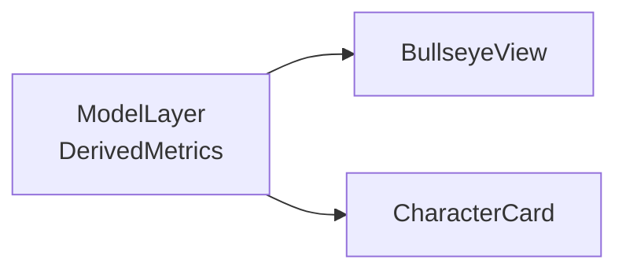

# Life Dashboard — Architecture

High-level structure, boundaries, and data flow for the Life Dashboard app. Lead/Test/Docs/UI/Game agents use this to decide what to build and where. The JSON stat-tree model is introduced in `docs/PROJECT.md`. The Phase 1 schema (Area/Tracker shapes, validation expectations) is defined in [docs/JSON-MODEL.md](JSON-MODEL.md); design details may also appear in `docs/DESIGN.md` where applicable.

---

## 1. Current and Intended Repository Layout

### 1.1 Current layout

Today the codebase looks roughly like:

- `life-dashboard/` — Vite + React + TypeScript + Tailwind app (the actual Life Dashboard implementation).
- `src/` (at repo root) — currently empty.

This means the app is **nested one level down** inside the repo.

### 1.2 Intended layout (after restructuring)

To simplify development and make documentation less confusing, the intended layout is:

- App lives at the **repo root**, with:
  - `src/` — React application source (components, hooks, pages, etc.).
  - `index.html`, `vite.config.*`, `package.json`, `tsconfig.*`, etc. — standard Vite root files.
- The existing empty root `src/` directory is removed.
- All content currently under `life-dashboard/` is **moved up** to the repo root.

Until that move is performed, any path references in docs that assume a root-level Vite app should be read as **“inside `life-dashboard/` for now”**.

---

## 2. High-Level Architecture

At a high level, the system is a **single-page React application** that:

- Loads a **JSON stat tree** describing domains, subdomains, and stats.
- Maintains **per-user state** (current values, preferences) in local storage.
- Computes **derived metrics** (completion, normalized scores) from that tree.
- Renders:
  - A **navigation tree** for exploring domains.
  - One or more **bullseye diagrams** summarizing progress.
  - A **character card** view surfacing key stats and flavor.
  - Editor/controls for adjusting stats and configuration.

```mermaid
flowchart LR
  JsonConfig[JSONStatTree]
  LocalState[LocalState<br/>(values, prefs)]
  Deriver[DerivedMetrics]
  Nav[DomainTreeUI]
  Bullseye[BullseyeView]
  Card[CharacterCard]
  Editors[Editors/Controls]

  JsonConfig --> Deriver
  LocalState --> Deriver
  Deriver --> Bullseye
  Deriver --> Card
  JsonConfig --> Nav
  JsonConfig --> Editors
  LocalState --> Editors
  Editors --> LocalState
```

In the MVP, **all data lives in the browser** (JSON configuration + local storage). Future iterations may add sync or import/export without changing this basic flow.

**View surfaces:** The **bullseye** and **character card** are sibling views: both are fed by the same derived metrics (completion per node, optional level/badges from the model). No view has its own private derivation logic.



---

## 3. Frontend Modules and Responsibilities

The exact file and folder structure may evolve, but the main concerns are:

### 3.1 Data model layer (`src/model/` or `src/domain/`)

**Owns:**

- Type definitions for:
  - `StatNode` / `DomainNode` (tree nodes).
  - `StatDefinition` (type, target, units, weight, etc.).
  - `UserStatState` (current values, timestamps).
- Functions to:
  - Validate and normalize JSON configurations.
  - Walk the tree and compute derived metrics (e.g. completion percentages).

**Consumes:**

- Raw JSON configuration (from bundled defaults or user import).
- User state (e.g. from local storage).

**Produces:**

- A normalized in-memory representation of the tree.
- Derived metrics per node (completion, aggregate scores, optional domain “levels”).

### 3.2 Persistence layer (`src/persistence/`)

**Owns:**

- Reading/writing:
  - JSON configuration (initially: static or embedded; later: user-edited and saved).
  - User state (current stat values, preferences) via `localStorage` or similar browser APIs.

**Consumes:**

- In-memory model and updated values from UI.

**Produces:**

- Stable storage across sessions.
- Hooks/utilities like `useLocalStorageState` or `saveConfig`.

Constraints:

- No backend is assumed for MVP.
- Future sync/backends must treat local data as primary and respect privacy.

### 3.3 View model / state layer (`src/state/` or React context)

**Owns:**

- Global app state:
  - Selected domain or stat.
  - View mode (bullseye vs card vs list).
  - Light-weight UI prefs (e.g., theme, whether to show gamey elements like levels).
- Glue logic that:
  - Loads JSON config and user state on startup.
  - Exposes derived tree + metrics to components.

Implementation options:

- Simple React context + hooks (likely sufficient for MVP).

### 3.4 Presentation components (`src/components/`)

Core components include:

- `DomainTree`:
  - Renders nested domains/subdomains.
  - Allows selection and basic editing (rename/add/remove) where supported.
- `Bullseye`:
  - Draws concentric rings and segments based on derived metrics.
  - Should be responsive and accessible (e.g. tooltips or labels for segments).
- `CharacterCard`:
  - Shows key stats, level, and flavor text.
  - Pulls from the same derived metrics used by the bullseye.
- `StatEditors`:
  - Controls to adjust current values, targets, or metadata.
- Layout and chrome:
  - Shell, navigation, settings, etc.

Each component should consume **typed props** derived from the model and avoid directly poking into raw JSON where possible.

### 3.5 Styling (`Tailwind CSS`)

**Owns:**

- Theme tokens (colors, spacing, typography).
- Component-level styling for bullseye, cards, and navigation.

Constraints:

- Keep styles in Tailwind (plus small CSS modules if necessary) rather than spreading ad-hoc inline styles.
- Maintain contrast and legibility, especially in data-dense views like the bullseye.

---

## 4. JSON Stat Tree and Derived Metrics

### 4.1 JSON configuration source and schema

The stat-tree shape (Area, Tracker, aggregation) is documented in [docs/JSON-MODEL.md](JSON-MODEL.md). Config may be loaded from a bundled default or from user-supplied JSON; the model layer consumes a validated structure only.

In the near term, there are two primary ways the app might receive its JSON:

- **Bundled default**:
  - A built-in JSON configuration (shipped with the app) that represents a sensible starter life ontology.
- **User-edited configuration**:
  - A JSON blob stored in local storage or a file the user can import/export.

The model layer should not care where the JSON came from; it only requires **shape**.

### 4.2 Derivation pipeline

Given:

- `ConfigTree` — the stat-tree from JSON (validated Area[]).
- `UserState` — current values, timestamps, and preferences.

The model layer should compute for each node:

- `normalizedCompletion` (0–1 or 0–100%).
- Optional `importanceWeight` (from config).
- Optional `level` or rank (future).

These outputs feed:

- The bullseye (visual encoding).
- The character card (headline stats).
- Any future charts or reports.

**Current progress formulas (Phase 1 implementation):**

- **Per-tracker completion (0–100%):**
  - `boolean`: 100 if value truthy, else 0.
  - If `target` present: `min((value / target) * 100, 100)`.
  - Else if `max` present: `(value / max) * 100`.
  - Else: 50 (no target/max).
- **Per-area completion:** Combine tracker and child completions using the area’s `aggregation`:
  - `average` (default): mean of all tracker and child completion values.
  - `weighted`: weighted mean using each tracker’s `weight` (default 1) and child weight 1.
  - `minimum`: minimum of all tracker and child completion values.

Behavior is deterministic for the same tree and values. These formulas may live in the model layer (e.g. `src/model/` or `src/domain/`) or in a hook that the architecture later refactors into the model; see T2.

**Milestone progress:** The model layer also computes **milestone-based progress** per area from the completion log and area achievements (see §5). The bullseye can show either tracker-based or milestone-based progress via a view toggle.

**Gamification (levels, badges, XP):** Level and badge computations live in the **model layer** (`src/model/gamification.ts` and derived metrics). They consume normalized completion, the achievement tree, and the completion log. The character card and other UI read precomputed level/badge/XP values from the model.

---

## 5. Gamification Surfaces

Gamification is layered **on top of** the JSON model and derived metrics.

**Implemented surfaces:**

- **Global character level (1–4):** Derived from aggregate tracker completion (average of root areas).
- **XP and XP level:** Per-domain XP is stored in user state; global XP is the sum. XP level formula: `floor(sqrt(globalXp / 100)) + 1`. Tasks and milestones grant configurable `xpReward` on completion.
- **Milestone progress:** Per-area progress based on completed milestones vs total milestones (from `area.achievements` and completion log). The bullseye supports a “By trackers” / “By milestones” view toggle.
- **Badges:** Progress-based (Getting started, Halfway, On track, Fully balanced) and milestone-based (First milestone, Five milestones, Ten milestones). Unlocked badge ids are stored in user state.
- **Cosmetics (titles, avatar):** Titles and avatar skins unlock by milestone count; user selects one title and one avatar to display on the character card. No currency or loot boxes.

**User state (gamification):** Persisted with the rest of dashboard state: `completionLog`, `domainXp`, `unlockedBadges`, `unlockedTitles`, `avatarUnlocks`, `selectedAvatar`, `selectedTitle`. See [JSON-MODEL.md](JSON-MODEL.md) §6.

Architect and Game Design agents define exact rules and thresholds; the architecture keeps computation in the model layer and presentation in components.

---

## 6. Environment and Tooling

The app stack is:

- **Frontend:** React + TypeScript.
- **Bundler/dev server:** Vite.
- **Styling:** Tailwind CSS.

Once the `life-dashboard/` contents are promoted to the root, `docs/DEV.md` should be updated so that standard commands look like:

- Development: `npm run dev` (or `pnpm dev` / `yarn dev` depending on chosen manager).
- Test: `npm test` or equivalent.
- Build: `npm run build`.
- Lint/typecheck: project-specific scripts (e.g. `npm run lint`, `npm run typecheck`).

No backend or external services are assumed for MVP.

---

## 7. Constraints and Non-Goals (Architecture)

- **Local-first:** All core functionality should work entirely in the browser without network access.
- **Privacy by default:** No personal stat data leaves the device unless a future sync feature is explicitly enabled.
- **Simplicity over abstraction:**
  - Prefer straightforward TypeScript types and functions over heavy generic frameworks for the model layer.
- **Single source of truth:** The JSON stat tree + user state should be the authoritative representation from which all views are derived.

Future extensions (sync, templates, sharing) should build on these foundations rather than replacing them.
